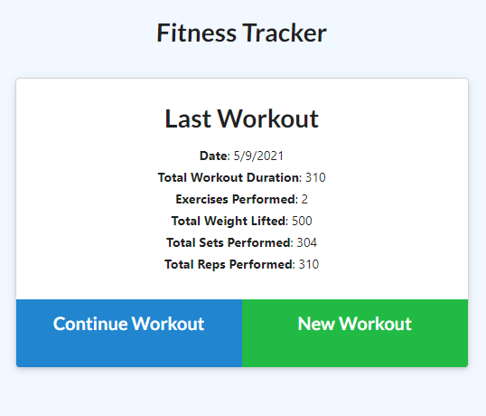
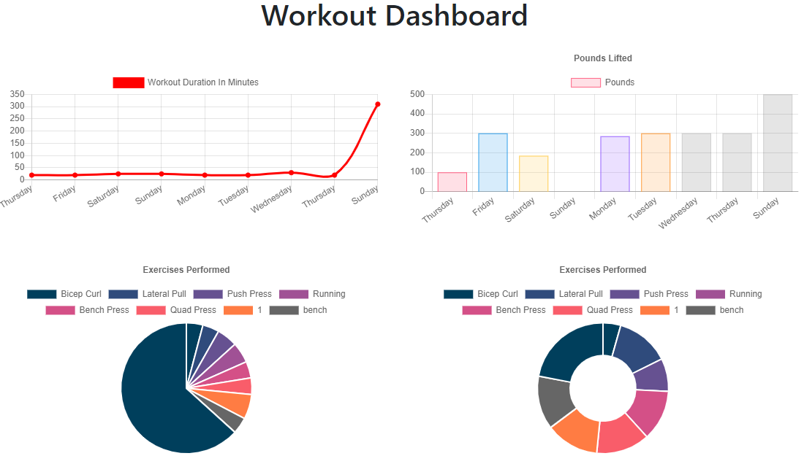
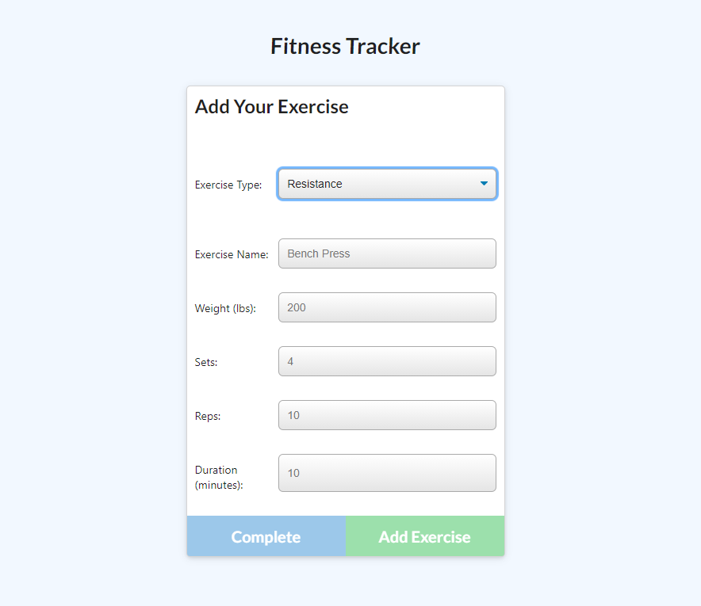
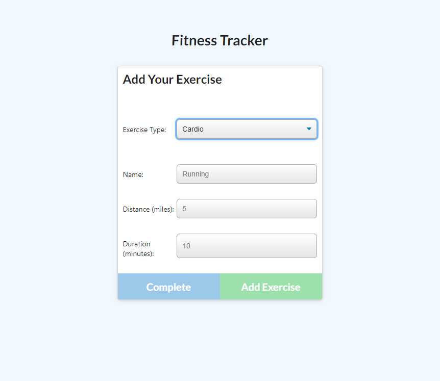

 
# 
 **Fitness Tracker Application** 

---
## **Table Of Contents** 

---

1. [Description](#description)
2. [Installation](#installation)
3. [Usage](#usage)
4. [App and Contact](#contact)

--- 

## 
  **Description** 
 

--- 

This is an application that uses express, mongoDB and with a semi MVC style system. It was developed to be a useful workout tracker and tool with a visualizer to help users be able to stay motivated and understand their trends and habits. It was developed for Homework 17 "NOSQL" with the context of using MongoDB, a new DB framework instead of MySQL which we had been using recently. In a step to learn the MERN style development for websites popular in the industry today, this was the first application using the tool 'Mongo', in efforts to complete the quadfecta. Please feel free to use the app as much as you'd like. ENJOY!

--- 
 
## 
  **Installation** 

--- 

 In order to install this application via github in order to keep track of your own workouts, you can clone the repo then run "$npm init". After installing the necessary packages, run "$node server.js". The app will start on localhost:3000, go to that URL and you will see the application has started. If you would like a seed for the application you can run "$npm run seed" which will insert preloaded data into the mongo database.

--- 

## 
  **Usage** 

--- 
 

The main page that you will be introduced to includes useful information such as the date of your last workout, the total duration, the number of exercises performed among other information about that workout. Using the application involves two processes, either continuing a current workout, or creating a new workout.
 

Clicking the new workout button will bring you to a page where you can choose either Resistance or Cardio. Choosing one or the other will give you different options as you can see from the two images on the right (Resistance) and below (Cardio). The two categories give you appropriate options for the workout that you are doing. They will be recorded with the correct records as well. Upon filling out the information for the exercise that you are doing, you can complete the entry or add another entry to your current workout. After completing all the desired forms for your workout, your data will appear on the main page under "Last Workout".

 

You can view all the other information about your workout and trends on the dashboard (IMG1) displaying all your workouts, frequency and duration. It's a simple and intiuitive application that allows for easy tracking of your lifting and aerobic exercises. I'd say it's quite the catch, and pretty to look at as well! That is all, thanks for checking out my application that I worked really hard on!

--- 
## 
  **App and Contact**

---
### *Heroku:* [Fitness Tracker](https://thefitbit.herokuapp.com/)
### *Github:* [calvinjacobsen/fitness-tracker](https://github.com/CalvinJacobsen/FitnessTracker)
### *Email:* Jaco1932@umn.edu

--- 
